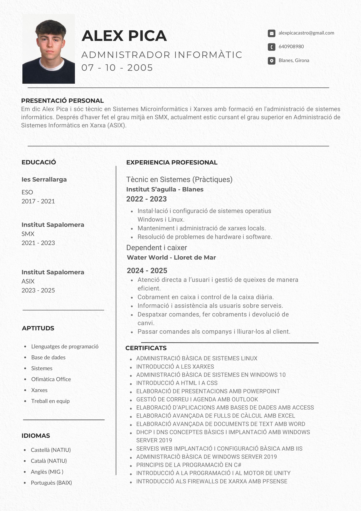
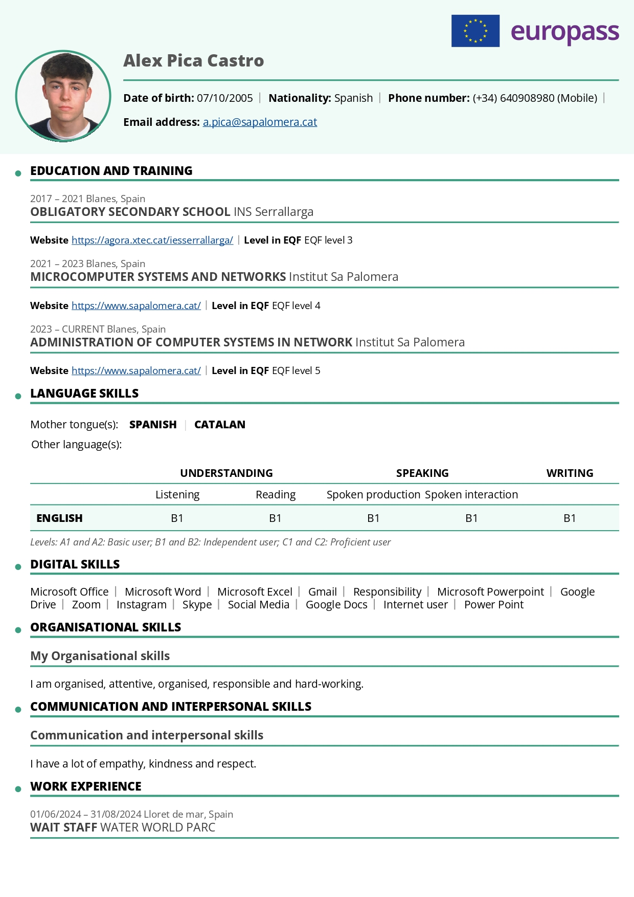

# IPOP - Informe Personal d'Orientació Professional

## 👤 Qui soc jo?

**Nom:** Àlex Pica Castro  
**Data de naixement:** 07-10-2005   
**Correu:** [alexpicacastro@gmail.com](mailto:alexpicacastro@gmail.com) | [a.pica@sapalomera.cat](mailto:a.pica@sapalomera.cat)  
**Telèfon:** 640 908 980  

### Presentació Personal
Em dic Alex Pica i sóc tècnic en Sistemes Microinformàtics i Xarxes amb formació en l'administració de sistemes informàtics. Després d'haver fet el grau mitjà en SMX, actualment estic cursant el grau superior en Administració de Sistemes Informàtics en Xarxa (ASIX). Persona proactiva, responsable i amb gran interès en l’administració de sistemes, xarxes i ciberseguretat.

### Currículum

---

## 🎓 Formació Acadèmica

| Període | Titulació | Centre | Nivell EQF |
|---------|-----------|--------|------------|
| 2023 - 2026 | CFGS Administració de Sistemes Informàtics en Xarxa (ASIX) | Institut Sapalomera | EQF 5 |
| 2021 - 2023 | CFGM Sistemes Microinformàtics i Xarxes (SMX) | Institut Sa Palomera | EQF 4 |
| 2017 - 2021 | ESO | IES Serrallarga | EQF 3 |

---

## 🏢 Experiència Laboral

### Tècnic en Sistemes (Pràctiques) — Institut S'Agulla, Blanes
**Període:** 2022 - 2023
- Instal·lació i configuració de sistemes operatius Windows i Linux.
- Manteniment i administració de xarxes locals.
- Resolució de problemes de hardware i software.

---

## 📋 Perfil Professional

### Identificació del títol
- **Títol:** Administració de sistemes informàtics en xarxa
- **Nivell:** Formació professional de grau superior
- **Família professional:** Informàtica i comunicacions
- **Durada:** 2.000 hores

### Competència general
Configurar, administrar i mantenir sistemes informàtics, garantint la funcionalitat, la integritat dels recursos i serveis del sistema, amb la qualitat exigida i complint la reglamentació vigent.

---

## 💻 Competències i Habilitats

### Aptituds Tècniques
- Llenguatges de programació
- Base de dades
- Sistemes (Windows i Linux)
- Ofimàtica Office
- Xarxes
- Treball en equip

### Habilitats Organitzatives
Organitzat, atent, responsable i treballador.

### Habilitats de Comunicació i Interpersonals
Empatia, amabilitat i respecte. Gran capacitat de comunicació per explicar solucions tècniques a usuaris no experts.

---

## 🌐 Idiomes

| Idioma | Nivell |
|--------|--------|
| Castellà | Natiu |
| Català | Natiu |
| Anglès | Mitjà (B1) |
| Portuguès | Baix |

### Anglès — Detall de competències

| | Comprensió oral | Comprensió lectora | Producció oral | Interacció oral | Escriptura |
|---|---|---|---|---|---|
| **Anglès** | B1 | B1 | B1 | B1 | B1 |

---

## 📜 Certificats

- Administració Bàsica de Sistemes Linux
- Introducció a les Xarxes
- Administració Bàsica de Sistemes en Windows 10
- Introducció a HTML i a CSS
- Elaboració de Presentacions amb PowerPoint
- Gestió de Correu i Agenda amb Outlook
- Elaboració d'Aplicacions amb Bases de Dades amb Access
- Elaboració Avançada de Fulls de Càlcul amb Excel
- Elaboració Avançada de Documents de Text amb Word
- DHCP i DNS Conceptes Bàsics i Implantació with Windows Server 2019
- Serveis Web Implantació i Configuració Bàsica amb IIS
- Administració Bàsica de Windows Server 2019
- Principis de la Programació en C#
- Introducció a la Programació i al Motor de Unity
- Introducció als Firewalls de Xarxa amb pfSense

---

## 🎯 Objectius Professionals

**Meta:** Especialitzar-me en administració de sistemes i xarxes amb l’objectiu de treballar com a administrador de sistemes o tècnic de xarxes dins de mitjanes o grans empresas.

**Itinerari:** El pla actual es centra en finalitzar amb èxit el CFGS d'ASIX el 2026 per consolidar el perfil tècnic.

---

## 📧 Contacte

- **Correu Institucional:** [a.pica@sapalomera.cat](mailto:a.pica@sapalomera.cat)
- **Correu Personal:** [alexpicacastro@gmail.com](mailto:alexpicacastro@gmail.com)
- **Telèfon:** 640 908 980
- **GitHub:** [github.com/alexpicacastro](https://github.com/alexpicacastro)
- **Wix:** [https://apica3.wixsite.com/website](https://apica3.wixsite.com/website)
- **LinkedIn:** [https://www.linkedin.com/in/alexpicacastro/](https://www.linkedin.com/in/alexpicacastro/)
